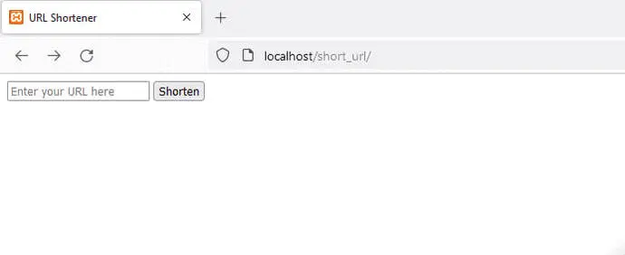

# short_url
Создание короткого url

Настройка бд
- host = localhost,
- username = root,
- password = "",
- database = url_shortener

Добавить в бд поле urls

`CREATE TABLE urls (
id INT AUTO_INCREMENT PRIMARY KEY,
long_url VARCHAR(255) NOT NULL,
short_code VARCHAR(6) NOT NULL
);`

Доступ по api, метод POST:

### http://localhost/short_url/api/

body JSON:

### `{"url":"https://www.php.net/"}`
